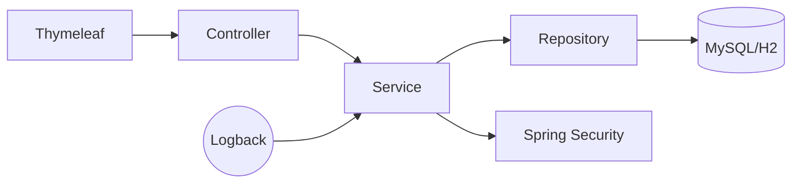

# Book Management 📚

<details>
<summary>📖 Table of Contents</summary>

- [🔍 Overview](#-overview)  
- [✨ Features](#-features)  
- [🏗️ Architecture & Technologies](#️-architecture--technologies)  
- [📁 Project Structure](#-project-structure)  
- [🔐 Security](#-security)  
- [🚀 How to Run](#-how-to-run)  
- [📸 Demo](#-demo)  
- [📋 API Reference](#-api-reference)  
- [🧪 Testing](#-testing)  
- [👥 Team](#-team)  
- [📄 License](#-license)

</details>

<a id="overview"></a>
## 🔍 Overview
**BookManagement** is a full-stack web application developed as part of the *Web Applications for Databases* course (Master’s, Year 1, 2025).  
It provides a complete solution for managing book collections, authors, genres, and user reviews, with robust authentication and authorization features.  
The app demonstrates multiple entity relationships, CRUD operations, validation, authentication, logging, pagination, and testing, according to the project requirements.

<a id="features"></a>
## ✨ Features
<details>
<summary>Show features</summary>

- User management (registration, login, role-based access control)  
- Book catalog (CRUD with pagination and sorting)  
- Review system (users can add ratings and comments for books)  
- Admin panel (manage authors, books, users)  
- Responsive design (Thymeleaf + Bootstrap 5)  
- Secure authentication (Spring Security + BCrypt)  

</details>

<a id="entities-and-relationships"></a>
## Entities & Relationships
The application defines **6 entities** with all relationship types:

- **User** <-> `@OneToMany` Reviews, `@OneToMany` UserBook  
- **Book** <-> `@ManyToOne` Author, `@ManyToOne` Genre, `@OneToMany` Reviews, `@OneToMany` UserBook  
- **Author** <-> `@OneToMany` Books  
- **Genre** <-> `@OneToMany` Books  
- **Review** <-> `@ManyToOne` User, `@ManyToOne` Book  
- **UserBook** <-> `@ManyToOne` User, `@ManyToOne` Book (join table for ManyToMany)  

| Entity   | Relationships |
|----------|---------------|
| **User** | `@OneToMany` Reviews, `@OneToMany` UserBook |
| **Book** | `@ManyToOne` Author, `@ManyToOne` Genre, `@OneToMany` Reviews, `@OneToMany` UserBook |
| **Author** | `@OneToMany` Books |
| **Genre** | `@OneToMany` Books |
| **Review** | `@ManyToOne` User, `@ManyToOne` Book |
| **UserBook** | `@ManyToOne` User, `@ManyToOne` Book |

<a id="architecture--technologies"></a>
## 🏗️ Architecture & Technologies


| Technology | Version |
|------------|---------|
| Java | 17 |
| Spring Boot | 3.x |
| MySQL | 8.0 |
| H2 Database | (for testing) |
| JUnit | 5 |
| Maven | |
| Lombok | |
| SLF4J | |
<a id="project-structure"></a>
## 📁 Project Structure
```
BookManagement/
└── src/main/java/com/unibuc/bookmanagement
    ├── aspects/               # AOP classes (logging, performance monitoring)
    ├── config/                # Configuration classes
    ├── controllers/           # Web controllers
    ├── dto/                   # Data Transfer Objects
    ├── errors/                # Error handling
    ├── exception/             # Custom exceptions
    ├── junction_tables/       # Many-to-many junction tables
    ├── models/                # JPA entities
    ├── repositories/          # Data access layer
    ├── services/              # Business logic layer
    └── BookmanagementApplication.java  # Main application class
```

<a id="security"></a>
## 🔐 Security
The application uses **Spring Security** with a custom `UserDetailsService` and JDBC-based authentication.
- **Password storage**: All user passwords are hashed using `BCryptPasswordEncoder`.
- **Public routes**: `/users/register`, `/users/login`, and static resources (`/css/**`, `/js/**`, `/images/**`).
- **Book browsing**: `/books`, `/books/{id}`, and `/books/find` are accessible without authentication.
- **Admin-only routes**: Adding books or authors (`/books/add`, `/authors/add`) requires `ROLE_ADMIN`.
- **Authenticated routes**: Any other `/books/**` endpoint (e.g., update, delete) and all other parts of the application require login.
- **Login/Logout**: Custom login page at `/users/login`, with redirect to `/books` after login. Logout redirects to `/users/login?logout`.

<a id="how-to-run"></a>
## 🚀 How to Run
<details>
<summary>Detailed Steps</summary>

### 1. Clone the Repository
```bash
git clone https://github.com/GheorgheBriana/bookmanagement.git
cd bookmanagement
```

### 2. Configure the Database
Create the development database in MySQL:
```sql
CREATE DATABASE book_management;
```

Update the database credentials in `src/main/resources/application-dev.yml`:
spring:
  datasource:
    url: jdbc:mysql://localhost:3306/book_management
    username: your_username
    password: your_password

### 3. Build and Run
mvn clean spring-boot:run -Dspring-boot.run.profiles=dev

### 4. Access the Application
- **Login page**: http://localhost:8080/users/login
- **Registration page**: http://localhost:8080/users/register
- **Books list**: http://localhost:8080/books
- **Authors list**: http://localhost:8080/authors
- **Book reviews**: http://localhost:8080/reviews/book/{book_id}
</details>

<a id="-demo"></a>
## 📸 Demo
<details>
**Live Demo:** [http://localhost:8080/books](http://localhost:8080/books)

- **Registration**  
  [http://localhost:8080/users/register](http://localhost:8080/users/register)  

  

- **Login**  
  [http://localhost:8080/users/login](http://localhost:8080/users/login)  
  After registration, the user is redirected to the login page where they must enter their username and password.  

  

- **Home Page**  
  [http://localhost:8080/books](http://localhost:8080/books)  

  

- **Book Details**  
  [http://localhost:8080/books/{id}](http://localhost:8080/books/{id})  
  Clicking on a book redirects to the details page, where users can add reviews. Admins can delete the book from here.  

  

- **Book Reviews**  
  [http://localhost:8080/reviews/book/{bookId}](http://localhost:8080/reviews/book/{bookId})  
  Displays all reviews for a specific book.  

  

- **Add Review**  
  A logged-in user can add a review by providing a description and a rating between 1 and 5.  

  

- **Add Book (Admin only)**  
  Only admins can add books. The admin provides the title, description, and ISBN, then selects an existing author from the database (or adds a new one). After submission, the book becomes visible at `/books`.  


- **Add Author**  
  

- **Authors List**  
  
</details>

<a id="api-reference"></a>
## 📋 API Reference
<details>

### Books
| Method | Endpoint        | Description                          |
|--------|-----------------|--------------------------------------|
| GET    | /books          | List all books (paginated)           |
| GET    | /books/{id}     | View details of a specific book      |
| GET    | /books/add      | Display the add book form (HTML)     |
| POST   | /books/add      | Create a new book (requires ADMIN)   |

### Authors
| Method | Endpoint            | Description                          |
|--------|---------------------|--------------------------------------|
| GET    | /authors            | List all authors (paginated)         |
| GET    | /authors/add        | Display the add author form (HTML)   |
| POST   | /authors/add        | Create a new author (requires ADMIN) |
| GET    | /authors/edit/{id}  | Display the edit author form         |
| POST   | /authors/update/{id}| Update author details                |

### Reviews
| Method | Endpoint                  | Description                            |
|--------|---------------------------|----------------------------------------|
| GET    | /reviews/book/{bookId}    | List all reviews for a book             |
| GET    | /reviews/add/{bookId}     | Display the add review form (HTML)      |
| POST   | /reviews/add/{bookId}     | Submit a new review for a book          |

### Genres (REST API)
| Method | Endpoint          | Description                  | Example Response                      |
|--------|-------------------|------------------------------|---------------------------------------|
| GET    | /api/genres       | List all genres              | `[{"id":1,"name":"Fiction"}]`         |
| GET    | /api/genres/{id}  | Get details of a genre       | `{"id":1,"name":"Fiction"}`           |

### UserBooks (REST API)
| Method | Endpoint                       | Description                              | Example Response                       |
|--------|--------------------------------|------------------------------------------|----------------------------------------|
| GET    | /api/userbooks/users/{userId}  | List all books of a user                  | `[{"userId":1,"bookId":2}]`            |
| POST   | /api/userbooks                 | Create a user-book relation (JSON)        | `{"userId":1,"bookId":2}`              |

### Users
| Method | Endpoint        | Description                              |
|--------|-----------------|------------------------------------------|
| GET    | /users/login    | Display login form (HTML)                |
| POST   | /users/login    | Authenticate user                        |
| GET    | /users/register | Display registration form                |
| POST   | /users/register | Create a new user account                |
</details>

<a id="testing"></a>
## 🧪 Testing
<details>
<summary>Testing Details</summary>

Run all tests with in-memory H2:
mvn test

### Types of tests:
  - Unit tests: services & repositories
  - Integration tests: controllers
  - Profile-specific configuration: the test profile automatically configures H2

### Useful test commands
# Run a specific test class
mvn -Dtest=BookServiceTest test

# Run with detailed logs
mvn -Dspring-boot.run.profiles=test -Dlogging.level.root=DEBUG test

## Unit Testing
Unit testing was implemented using **JUnit 5** and **Mockito**.  
The tests validate the business logic for the main entities of the application: books, authors, reviews, users, and genres.

### Example unit tests
- **Test creating a valid book**
@Test
void testCreateValidBook() {
    Book book = new Book("Title", "Description", "1234567890123", 1L);
    when(bookRepository.save(book)).thenReturn(book);
    Book result = bookService.createBook(book);
    assertEquals("Title", result.getTitle());
}

</details>

<a id="team"></a>
## 👥 Team
- Student 1: Gheorghe Briana
- Student 2: Turcitu Ana  
- Course: Master's in Databases and Software Technologies (Year 1, 2025)  
- Subject: Web Applications for Databases  

<a id="license"></a>
## 📄 License
Distributed under the [MIT License](https://opensource.org/licenses/MIT).

</details>

