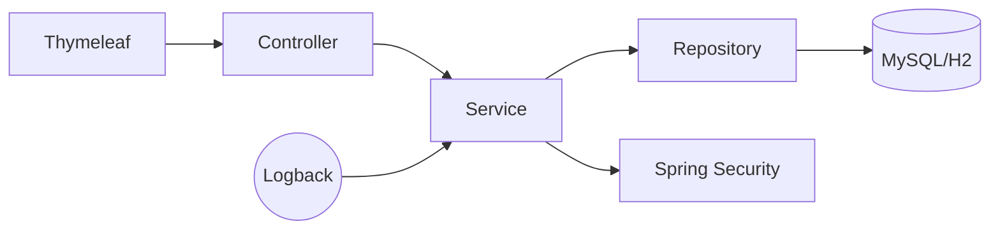

# Book Management 📚

## 1. Description

**BookManagement** is a web application built with Spring Boot that manages books, authors, genres, users, and reviews. It was developed in a team of two students as part of the **"Web Applications for Databases" (Master, Year 1, 2025)** course.

The application demonstrates the use of multiple entity relationships, CRUD operations, validation, authentication, logging, pagination, and testing, according to the project requirements.

---

## Covered Requirements
1. **Entity relationships**: Includes `@OneToOne`, `@OneToMany`, `@ManyToOne`, `@ManyToMany`.  
2. **CRUD operations**: Full Create, Read, Update, Delete implemented for all entities via controllers and views.  
3. **Profiles & databases**:  
   - `dev` profile -> uses **MySQL** for development/production.  
   - `test` profile -> uses **H2 in-memory** database for testing.  
4. **Testing**: Both unit and integration tests using JUnit and Spring Boot Test.  
5. **Views & validation**: Thymeleaf forms with `@Valid`, custom exception handling (`@ControllerAdvice`).  
6. **Logging**: Configured via SLF4J (application + persistence layer logs).  
7. **Pagination & sorting**: Implemented for listing entities with Spring Data `Pageable`.  
8. **Spring Security**: JDBC authentication with `users` and `roles` tables.  

---

## Entities and Relationships
The application defines **6 entities** with all relationship types:

- **User** <-> `@OneToMany` Reviews, `@OneToMany` UserBook  
- **Book** <-> `@ManyToOne` Author, `@ManyToOne` Genre, `@OneToMany` Reviews, `@OneToMany` UserBook  
- **Author** <-> `@OneToMany` Books  
- **Genre** <-> `@OneToMany` Books  
- **Review** <-> `@ManyToOne` User, `@ManyToOne` Book  
- **UserBook** <-> `@ManyToOne` User, `@ManyToOne` Book (join table for ManyToMany)  

| Entity | Relationships |
|--------|---------------|
| **User** | `@OneToMany` Reviews, `@OneToMany` UserBook |
| **Book** | `@ManyToOne` Author, `@ManyToOne` Genre, `@OneToMany` Reviews, `@OneToMany` UserBook |
| **Author** | `@OneToMany` Books |
| **Genre** | `@OneToMany` Books |
| **Review** | `@ManyToOne` User, `@ManyToOne` Book |
| **UserBook** | `@ManyToOne` User, `@ManyToOne` Book |
---

## 4. How to Run ⚙️

### 1. Configure the Database
Create the development database in MySQL:
```sql
CREATE DATABASE book_management;
```
Update database credentials in `src/main/resources/application-dev.yml`:
```yaml
spring:
  datasource:
    url: jdbc:mysql://localhost:3306/book_management
    username: your_username
    password: your_password
```
### 2. Build and Run
```bash
mvn clean spring-boot:run -Dspring-boot.run.profiles=dev
```
### 3. Access the Application
- **Login page**: http://localhost:8080/users/login
- **Register page**: http://localhost:8080/users/register
- **Books list**: http://localhost:8080/books
- **Authors list**: http://localhost:8080/authors
- **Book reviews**: http://localhost:8080/reviews/book/{book_id}

---

## 5. Testing 
    Run all tests with H2 in-memory DB:

```bash
mvn test
```

### Test types:
  - Unit tests: services & repositories
  - Integration tests: controllers
  - Profile-specific config: test profile auto-configures H2
  
### Useful Test Commands

```bash
# Run a specific test class
mvn -Dtest=BookServiceTest test
# Run with detailed logs
mvn -Dspring-boot.run.profiles=test -Dlogging.level.root=DEBUG test
```

---
## Architecture and Technologies Used



| Technology | Version |
|------------|---------|
| Java | 17 |
| Spring Boot | 3.x |
| MySQL | 8.0 |
| H2 Database | (for testing) |
| JUnit | 5 |
| Maven | |
| Lombok | |
| SLF4J | |
---

## Project Structure
```
BookManagement/
└── src/main/java/com/unibuc/bookmanagement
    ├── aspects/          # AOP classes (logging, performance monitoring)
    ├── config/           # Configuration classes
    ├── controllers/      # Web controllers
    ├── dto/              # Data Transfer Objects
    ├── errors/           # Error handling
    ├── exception/        # Custom exceptions
    ├── junction_tables/  # Many-to-many join tables
    ├── models/           # JPA entities
    ├── repositories/     # Data access layer
    ├── services/         # Business logic layer
    └── BookmanagementApplication.java  # Main application class
```
---

## Features 
- Users can register and log in securely.
- Authenticated users can browse books and authors.
- Admin users can add, edit, and delete books, authors, and genres.
- Users can write reviews for books and see reviews from others.
- Pagination and sorting available in books and authors listings.

## Security 
The application uses **Spring Security** with a custom `UserDetailsService` and JDBC-based authentication.

- **Password storage**: All user passwords are hashed using `BCryptPasswordEncoder`.  
- **Public routes**: `/users/register`, `/users/login`, and static resources (`/css/**`, `/js/**`, `/images/**`).  
- **Book browsing**: `/books`, `/books/{id}`, and `/books/find` are accessible without authentication.  
- **Admin-only routes**: Adding books or authors (`/books/add`, `/authors/add`) requires `ROLE_ADMIN`.  
- **Authenticated routes**: Any other `/books/**` endpoint (e.g., update, delete) and all other parts of the app require login.  
- **Login/Logout**: Custom login page at `/users/login`, with successful login redirecting to `/books`. Logout redirects to `/users/login?logout`.  

## Team 
- Student 1: Gheorghe Briana
- Student 2: Turcitu Ana  
- Course: Master’s in Databases and Software Technologies (Year 1, 2025)  
- Discipline: Web Applications for Databases  

## License 📄
This project was created for academic purposes. All rights reserved.
